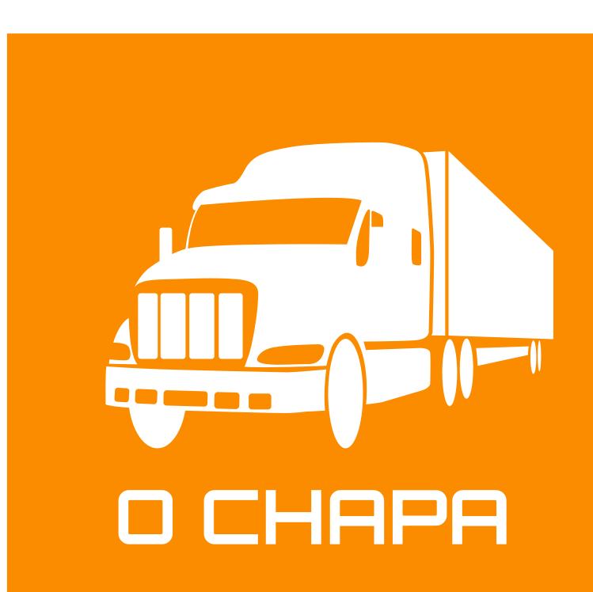

# O Chapa
## Seu ajudante da estrada

Para mais informações, consultem o video de apresentação no youtube!

[O Chapa - Seu ajudante da estrada - Hackathon CCR 2020](https://www.youtube.com/watch?v=cAg1SiPA4L8&feature=youtu.be)

O projeto é focado na melhora de vida do caminhoneiro.

Nosso aplicativo disponibiliza opções onde caminhoneiros podem encontrar locais com a melhor infraestrutura possivel, podendo dar o máximo de conforto e segurança para os trabalhadores da classe. Além de localização de locais como paradas, restaurantes, banheiro, postos de abastecimentos e até oficinas, o aplicativo também conta com uma área de saúde e segurança.

A área de saúde é inteiramente dedicada à saúde fisica, mental e alimentar dos caminhoneiros, apresentando conteúdos e opções de alimentação e exercicios que podem fazer no dia a dia, sem prejudicar suas horas de trabalho, indicando sempre os melhores exercicios para o período de tempo trabalhado.

Focando na área de segurança,  pensamos no quão importantes é o acesso rápido a números telefonicos de urgência e acesso a denuncias dentro do aplicativo, tornando o período de trabalho muito mais agradável para os caminhoneiros e caminhoneiras do Brasil.

### Projeto desenvolvido com FLutter e Firebase

### Arquitetura e implementação técnica por [1cadumagalhaes](https://1cadumagalhaes.github.io)
