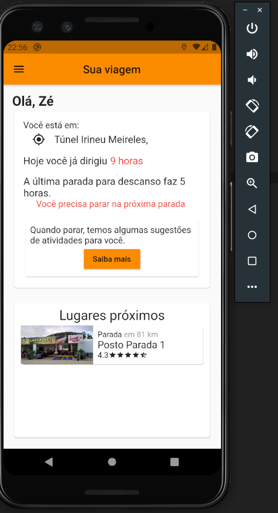

# O Chapa

Este projeto está em fase inicial de desenvolvimento.

Toda a fase de ideação e o desenvolvimento do MVP foram feitos durante o Hackathon CCR, dos dias 12/06/2020 à 14/06/2020

Toda a arquitetura foi feita utilizando ferramentas do Firebase.

A parte de autenticação é feita usando o pacote firebase_auth.
Os dados que são armazenados ficam no Cloud Firestore, na estrutura de documentos.
Temos os dados de usuários, locais, informações de segurança e reclamações feitas pelo app. 

As imagens são armazenadas no Cloud Storage ou consumidas via url. 

## Sobre o app
Nosso aplicativo é um protótipo funcional, feito de forma a ser escalável. Com poucos ajustes o aplicativo já está pronto para ser lançado.

Toda a configuração foi feita para Android, mas o app pode ser compilado para iOS. 

## Telas

1. Home

   

2. Menu

   

3. Lugares

   

4. Saúde

   

5. Segurança

   

6. Local

   
   

A implementação de geolocalização está funcional e os valores de distância mostrados são reais.
